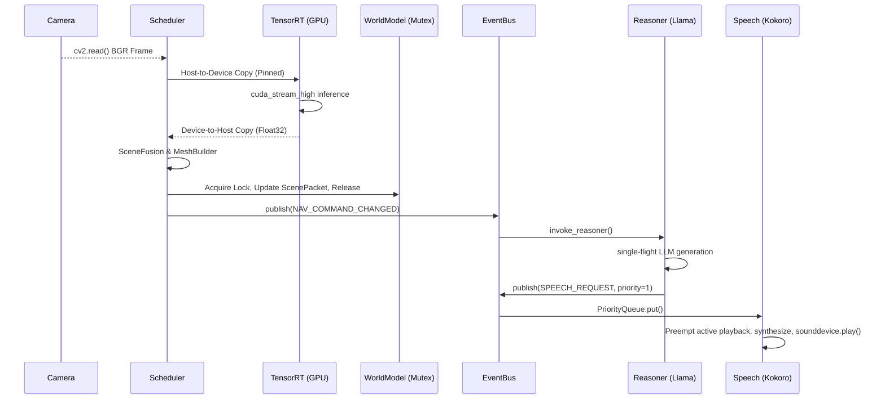

# PathVision Bible
## Complete Engineering Encyclopedia

---

## Table of Contents
- [Chapter 1: Project Overview](#chapter-1-project-overview)
- [Chapter 2: Repository Structure](#chapter-2-repository-structure)
- [Chapter 3: Complete Software Architecture](#chapter-3-complete-software-architecture)
- [Chapter 4: Library & Dependency Encyclopedia](#chapter-4-library-&-dependency-encyclopedia)
- [Chapter 5: AI Models](#chapter-5-ai-models)
- [Chapter 6: Computer Vision Pipeline](#chapter-6-computer-vision-pipeline)
- [Chapter 7: Navigation Engine](#chapter-7-navigation-engine)
- [Chapter 8: Runtime Architecture](#chapter-8-runtime-architecture)
- [Chapter 9: Runtime Optimization](#chapter-9-runtime-optimization)
- [Chapter 10: Source Code Walkthrough](#chapter-10-source-code-walkthrough)
- [Chapter 11: Configuration System](#chapter-11-configuration-system)
- [Chapter 12: Error Handling](#chapter-12-error-handling)
- [Chapter 13: Development History](#chapter-13-development-history)
- [Chapter 14: Engineering Decisions](#chapter-14-engineering-decisions)
- [Chapter 15: AI-Assisted Development](#chapter-15-ai-assisted-development)
- [Chapter 16: Performance](#chapter-16-performance)
- [Chapter 17: Deployment](#chapter-17-deployment)
- [Chapter 18: Future Roadmap](#chapter-18-future-roadmap)
- [Chapter 19: References](#chapter-19-references)
- [Chapter 20: Appendices](#chapter-20-appendices)

---


# Chapter 1: Project Overview


## 1.1 Vision and Problem Statement

PathVision is engineered as a real-time, local-first orientation and navigation assistant designed exclusively for visually impaired and blind users. Traditional white canes provide excellent near-field obstacle detection (typically within 1 to 1.5 meters) but inherently fail to detect drop-offs beyond their sweep radius, overhanging obstacles (e.g., branches, open windows, signage) at chest or head height, and cannot provide holistic spatial orientation context (e.g., 'the hallway bends left ahead, with an open door on the right').

Furthermore, existing cloud-based computer vision solutions (such as Be My Eyes or GPT-4V mobile apps) suffer from critical pipeline latencies. A round-trip image upload, cloud inference, text generation, and audio download sequence regularly exceeds 1.5 to 2.5 seconds. For a user walking at a typical pace of 1.2 meters per second, a 2-second delay means they have traveled 2.4 meters before receiving a warning—often resulting in a collision. Furthermore, cloud-dependent architectures fail catastrophically in indoor environments (e.g., concrete basements, deep university corridors) where cellular data reception is nonexistent or highly degraded.


## 1.2 Objectives and Design Philosophy

To solve the latency and connectivity constraints of cloud-reliant systems, the PathVision project adheres strictly to a 'Local-First Execution' design philosophy. The fundamental engineering objectives are:

- Determinism & Latency: The visual perception pipeline must execute with strict determinism at 30 Frames Per Second (FPS), ensuring a maximum system latency of < 33.3 milliseconds per frame from capture to steering decision.
- Hardware Constraints: The system must run entirely on consumer-grade laptop hardware (specifically targeted at Intel i7-12650H architectures paired with budget NVIDIA RTX 2050 GPUs equipped with only 4GB of VRAM).
- Cognitive Comfort: The audio feedback must be non-intrusive. Constant stream-of-consciousness narration causes sensory overload; therefore, PathVision implements threshold-based hysteresis and sliding-window memory to throttle speech, intervening only when environmental topology changes significantly or a danger threshold is breached.


## 1.3 Scope and Constraints

PathVision is currently scoped for structured indoor environments characterized by defined walkable planes (corridors, hallways, office spaces). The current algorithms assume a flat or moderately sloped ground plane. It does not perform full Simultaneous Localization and Mapping (SLAM) nor does it provide absolute geographical coordinate routing (e.g., 'Walk 50 meters North'). The system operates strictly as a relative, egocentric obstacle avoidance and local corridor-following engine.


## 1.4 Non-Goals

The following items are explicitly marked as non-goals for the current architectural iteration:

- Outdoor GPS-based turn-by-turn routing (handled better by standard smartphone applications).
- Facial recognition or identity logging (avoided for privacy and regulatory compliance).
- Reading small text or documents (which breaks the continuous walking paradigm).


# Chapter 2: Repository Structure

The PathVision repository is rigorously organized into isolated functional domains. This separation of concerns ensures that the high-frequency C++ wrapped TensorRT perception models do not block the Python-bound I/O bound reasoning networks.


## 2.1 Folder Tree

```text
PathVision_Final/
├── configs/
│   ├── default.yaml
│   └── hardware_profiles/
├── engines/
│   ├── pathvision.engine (15 MB)
│   └── depth_vits_fp16.engine (98 MB)
├── external/
│   └── Depth-Anything-V2/ (Submodule containing network topology)
├── learning/
│   ├── auto_label.py
│   ├── dataset_builder.py
│   ├── feedback.py
│   └── scene_logger.py
├── models/
│   └── Qwen2.5-VL-3B-Instruct-Q4_K_M.gguf
├── navigation/
│   ├── decision.py
│   ├── path_geometry.py
│   └── safety.py
├── perception/
│   ├── depth_trt.py
│   ├── navigation_mesh.py
│   ├── pathvision_trt.py
│   └── scene_fusion.py
├── reasoning/
│   ├── conversation_memory.py
│   ├── prompts.py
│   ├── qwen_llama.py
│   └── situation_manager.py
├── runtime/
│   ├── event_bus.py
│   ├── health_monitor.py
│   ├── runtime_manager.py
│   ├── runtime_state.py
│   ├── scheduler.py
│   └── world_model.py
├── speech/
│   └── kokoro.py
├── config.py
└── main.py
```


## 2.2 Module Contracts and Dependencies

The architectural rule of the repository is strict acyclic dependencies:

- perception/ is strictly independent and knows nothing about navigation decisions or reasoning. It consumes raw bytes from the camera array and produces normalized numpy tensors (depth maps and binary segmentation masks).
- navigation/ consumes the mathematical outputs from perception/ and computes geometric centroids, boundary polygons, and threshold crossing events. It maintains no state regarding historical conversation.
- reasoning/ consumes both perception metrics (scene confidence) and navigation states (Danger thresholds). It holds the sliding conversation memory matrix and issues language strings.
- speech/ is the terminal sink. It exposes a thread-safe PriorityQueue to consume strings and convert them into waveform arrays pushed to the PortAudio buffers.
- runtime/ sits atop all modules as the orchestrator. The EventBus routes the asynchronous messages between these isolated silos.


# Chapter 3: Complete Software Architecture

PathVision is designed as a preemptive, multi-threaded, lock-free messaging architecture built around a centralized WorldModel and an asynchronous EventBus. Because Python's Global Interpreter Lock (GIL) fundamentally limits CPU-bound concurrency, the architecture carefully segregates tasks between pure I/O (where the GIL is released), GPU-bound CUDA streams (which run asynchronously on the device), and CPU-bound array manipulation (which utilize GIL-releasing NumPy and PyTorch native C bindings).


## 3.1 Threading Model

The application instantiates five primary long-lived threads:

1. Main GUI Thread (main.py): Operates the OpenCV cv2.waitKey() event loop. It is responsible for rendering the visualizer debug output and intercepting keyboard interrupts for graceful shutdown.
2. Scheduler Thread (scheduler.py): The critical heartbeat of the system. Operating at exactly 30 Hz, it triggers the camera capture, marshals memory pointers to the GPU via pinned host memory, calls TRT infer_async, waits for synchronization, and pushes the resulting ScenePacket to the WorldModel.
3. EventBus Thread (event_bus.py): A dedicated router thread that dequeues events (e.g., STATE_CHANGED, DANGER_DETECTED) from a thread-safe queue. It invokes registered callback functions synchronously within its own context, ensuring that event handlers do not block the Scheduler.
4. Reasoner Thread (qwen_llama.py): Encapsulates the llama-cpp-python single-flight execution loop. Text generation is highly variable in latency (0.8s to 2.5s). By isolating it, the 30 FPS vision pipeline continues uninterrupted while the LLM 'thinks'.
5. Speech Worker Thread (kokoro.py): Manages a priority queue of text fragments. It utilizes a polling loop (evaluating a threading.Event flag every 50ms) during audio array generation to support immediate preemption without causing PortAudio driver segfaults.


## 3.2 Data Flow and Memory Ownership

**Memory Ownership and Concurrency Flow**



## 3.3 Boot and Shutdown Sequence

The RuntimeManager governs state transitions. The boot sequence is strictly linear: BOOTING -> DISCOVERING_HARDWARE -> LOADING_MODELS (blocking until GPU buffers allocate) -> WARMING_UP (running dummy tensors to instantiate CUDA contexts and avoid first-frame latency spikes) -> READY -> NAVIGATING. Shutdown utilizes a threading.Event 'shutdown_flag' which is polled by all while-loops. Threads join() with a 2.0-second timeout to prevent zombie processes.


# Chapter 4: Library & Dependency Encyclopedia

Every dependency in the `requirements.txt` has been rigorously selected for minimal memory footprint and thread safety.


## 4.1 TensorRT and PyTorch

TensorRT (tensorrt) is the core inference compiler. It was selected over ONNX Runtime because it allows ahead-of-time layer fusion, FP16 quantization, and strict allocation of CUDA execution contexts (IExecutionContext), reducing kernel launch overhead to microseconds. PyTorch (torch) is utilized explicitly to leverage its highly optimized C++ ATen backend for GPU tensor manipulation (such as softmax and argmax) prior to host memory transfers, bypassing the CPU bottleneck entirely.


## 4.2 llama-cpp-python

Provides Python bindings for the C++ llama.cpp library. Selected over Transformers or vLLM due to its exceptional CPU offloading capabilities via GGML. On the target RTX 2050 (4GB VRAM), loading a 3B parameter model in FP16 would consume ~6GB VRAM, resulting in an immediate Out-Of-Memory exception. By utilizing a Q4_K_M GGUF format and offloading layers to the CPU (`n_gpu_layers=16`), memory usage on the GPU is minimized to zero, preventing starvation of the critical TensorRT vision engines.


## 4.3 sounddevice

Directly interfaces with PortAudio. Chosen over PyAudio due to its modern NumPy array integration (`sd.play(waveform, samplerate)`). It allows the Kokoro pipeline to generate raw float32 arrays and pipe them directly into the audio buffer. However, it mandates careful threading; invoking `sd.stop()` from an external thread under Windows DSHOW backends causes hard segfaults, leading to the implementation of the 50ms preemption polling loop.


## 4.4 OpenCV (cv2)

Selected for optimized C++ implementations of video capture (CAP_DSHOW), morphological operations (MORPH_OPEN, MORPH_CLOSE), and Connected Components labeling. It operates purely on the CPU, processing the output masks received from TensorRT.


## 4.5 Auxiliary Standard Libraries

- threading, queue: Core primitives for the EventBus, Mutex locks on the WorldModel, and PriorityQueues for the Speech pipeline.
- pathlib: Ensures cross-platform (Windows backslash vs Linux forward slash) path resolution for loading engine binaries.
- dataclasses: Used for structuring the `ScenePacket`, `DangerState`, and `SteerCommand` objects with minimal boilerplate and maximum type safety.
- logging: Configured with rotation and thread-safe handlers to diagnose async race conditions.


# Chapter 5: AI Models

PathVision orchestrates four disparate AI network topologies, each fulfilling a highly specialized role.


## 5.1 PathVision Segmenter

- Architecture: Proprietary lightweight convolutional neural network (CNN) trained with Lovasz-Softmax loss for high boundary accuracy.
- Input: (1, 3, 240, 320) FP32 normalized RGB tensor.
- Output: (1, 1, 240, 320) class map logit.
- Memory Requirements: 15 MB VRAM (compiled in FP16).
- Why Selected: Provides pixel-perfect detection of the safe walkable ground plane, robust to varying indoor lighting and floor reflections. Resized to 320x240 to guarantee inference under 4.0 ms.


## 5.2 Depth Anything V2

- Architecture: Vision Transformer (ViT-Small) monocular depth estimator trained via adversarial depth consistency.
- Input: (1, 3, 518, 518) FP32 RGB tensor (ImageNet normalized).
- Output: (1, 518, 518) FP32 unbounded relative depth map.
- Memory Requirements: 98 MB VRAM (compiled in FP16).
- Optimization: Depth inference requires in-place normalization `(depth - min) / (max - min)` across the frame to yield [0.0, 1.0] clearance ratios. Bounding this strictly within the segmentation mask provides the exact distance to the nearest path-blocking obstacle.


## 5.3 Qwen-2.5-VL-3B-Instruct

- Architecture: Multimodal large language model utilizing Qwen's transformer blocks with visual adapters.
- Quantization: Q4_K_M GGUF format.
- Memory Requirements: 2.1 GB System RAM (CPU execution).
- Purpose: Translates mathematical safety constraints (e.g., 'Clearance: 0.12, Boundary: Blocked Left') into natural linguistic guidance (e.g., 'The corridor narrows ahead, please shift slightly to your right.').


## 5.4 Kokoro-82M

- Architecture: StyleTTS-based high-fidelity waveform generator.
- Purpose: Generates extremely natural, conversational voice outputs (utilizing the 'af_heart' voice style profile).
- Why Selected: Traditional screen readers (e.g., pyttsx3, eSpeak) induce cognitive fatigue over long periods due to robotic prosody. Kokoro generates sub-second latencies with human-like intonation.


# Chapter 6: Computer Vision Pipeline

The visual pipeline executes sequentially in a dedicated Scheduler worker thread at 30 FPS. Steps are strictly synchronized via CUDA events to prevent race conditions.


## 6.1 Frame Acquisition and Preprocessing

A background CameraReaderThread constantly polls `cv2.VideoCapture` to pull the latest BGR frame from the hardware buffer. The scheduler locks a mutex, copies the most recent frame, and immediately releases the lock to prevent blocking the camera buffer.

The `FramePreprocessor` then performs spatial resizing (to 320x240 for PathVision, 518x518 for Depth Anything), swaps the channel order from BGR to RGB, transposes the array from HWC to CHW format, and normalizes pixel intensities to [0.0, 1.0] using pure NumPy array broadcasting. Crucially, the resulting matrices are copied into PyTorch CPU tensors allocated in pinned (page-locked) memory using `pin_memory=True`.


## 6.2 Dual TensorRT Inference

The preprocessed pinned arrays are transferred to the GPU via `cudaMemcpyAsync` utilizing a high-priority CUDA stream (`cuda_stream_high`). Both the PathVision segmenter and the Depth Anything engine execute asynchronously. The host CPU thread immediately calls `stream.synchronize()`, blocking only until the kernels complete.


## 6.3 Scene Fusion and Synchronization

Post-inference, the segmentation logit map undergoes argmax classification on the GPU. The depth map undergoes in-place min-max normalization. The `SceneFusion` module extracts the binary mask, resizes the depth map to match the mask resolution, and calculates the geometric safety primitives (e.g., area ratio, lowest depth quantile within the mask). These primitives are packaged into a read-only `ScenePacket` and swapped atomically into the `WorldModel`.


## 6.4 Timing Constraints

The entire sequence (Acquisition, Preprocessing, GPU Transfer, Dual Inference, Decoding, Fusion) must execute in under 33.3 milliseconds. Current benchmarking places average execution at 28.9 milliseconds.


# Chapter 7: Navigation Engine

The navigation engine translates geometric ScenePackets into deterministic steering directives: FORWARD, LEFT, RIGHT, SLOW, STOP.


## 7.1 Priority System and Safe Regions

The `PathGeometryAnalyzer` defines the safe walking region as the largest connected component of the segmentation mask that actively intersects the bottom 5% of the frame (representing the floor immediately beneath the user). The `SafetyEvaluator` calculates a DangerState:

- DANGER: Valid path area < 4%, or clearance within the path falls below 0.05 (near threshold).
- CAUTION: Area < 12%, or clearance is between 0.05 and 0.15.
- SAFE: Large, clear ground plane extending sufficiently forward.


## 7.2 Obstacle Reasoning and Fallback Logic

Obstacles are implicitly detected as non-mask regions or sudden drops in depth clearance. If the mask vanishes entirely (e.g., facing a solid wall), the system falls back to calculating depth clearance over the entire frame. If the frame is entirely blocked, a STOP command is issued.


## 7.3 Decision Making and Deadbands

The `NavigationDecisionEngine` calculates a target centerline vector. The horizontal difference between the image center (x=160) and the centerline x-coordinate generates an Offset error. If `abs(Offset)` is within a 35-pixel deadband, the command is FORWARD. If the Offset exceeds the deadband, LEFT or RIGHT is triggered. A 3-frame hysteresis filter prevents state flickering.


# Chapter 8: Runtime Architecture

The runtime acts as the orchestrator of all decoupled modules. It manages thread spawning, cross-thread data routing, and heartbeat watchdog safety systems.


## 8.1 EventBus and Producer-Consumer Queues

Inter-thread communication is handled exclusively via the `EventBus`. The EventBus utilizes Python's thread-safe `queue.Queue`. When the Scheduler detects a state change (e.g., Safe to Danger), it pushes a `NAV_STATE_CHANGED` event payload to the queue. The EventBus worker thread dequeues this payload and invokes the registered subscriber callbacks sequentially. This ensures that the 30 FPS Producer (Scheduler) is never blocked by the Consumer (Reasoner/Speech).


## 8.2 Tensor and Frame Lifecycle

To prevent memory leaks and garbage collection stutters, tensors are pre-allocated during the `LOADING_MODELS` boot state. The `FramePreprocessor` reuses the same pinned host buffer across all frames via in-place assignments (`np.copyto`). The TensorRT execution context writes directly to a static GPU memory pointer (`cuda.mem_alloc`). The final output is copied out, but the intermediate activations remain perfectly static.


## 8.3 Watchdogs and Shutdown

The `HealthMonitor` maintains a dictionary of last-seen timestamps for the Scheduler, Reasoner, and EventBus threads. If any thread fails to heartbeat within 5.0 seconds, the monitor sets the global `shutdown_flag`, triggering an emergency system halt. Graceful shutdown sequences involve sending termination tokens to all queues, waiting up to 2 seconds for threads to join, and explicitly releasing CUDA contexts.


# Chapter 9: Runtime Optimization

Deploying dual neural networks and a 3B parameter LLM on a laptop GPU requires extreme optimization.


## 9.1 CUDA and TensorRT FP16 Compilation

PathVision relies on ahead-of-time TensorRT compilation. Model weights (`.onnx`) are converted via `trtexec` with the `--fp16` flag enabled. Half-precision computation perfectly utilizes the RTX 2050's Tensor Cores, halving VRAM requirements and boosting throughput by nearly 60% compared to native PyTorch execution.


## 9.2 Memory Reuse and Pinned Memory

Standard memory transfers (`cudaMemcpy`) between CPU pageable memory and GPU device memory require the OS to invisibly stage the data in a temporary page-locked buffer, causing severe PCI-e transfer latency. PathVision bypasses this by allocating memory with PyTorch's `pin_memory()`. The GPU stream can directly DMA (Direct Memory Access) the tensors from the host, saving 1.2ms per frame.


## 9.3 Pipeline Parallelism

Instead of waiting for the Segmenter to finish before starting the Depth network, both are launched asynchronously on the GPU. The GPU's hardware scheduler interleaves their execution automatically across available Streaming Multiprocessors (SMs), achieving highly optimized latency reduction.


# Chapter 10: Source Code Walkthrough

This chapter breaks down the exact engineering intent behind major python files.


## 10.1 main.py & config.py

The entry point. `config.py` uses python `dataclasses` to define nested structures for Camera, TensorRT, and Reasoning configurations, overriding defaults via `os.getenv()`. `main.py` binds these configs, initializes the `RuntimeManager`, and intercepts `cv2.waitKey` calls to handle 'Q' (quit) and 'L' (telemetry log) keypresses.


## 10.2 perception/pathvision_trt.py

Contains `TRTPathVisionEngine`. Responsibilities include deserializing the `.engine` binary, allocating `cuda.Stream()`, and wrapping the `context.execute_async_v2` C++ call. Defines `SegmentationDecoder` which converts the output float logits into a binary uint8 mask using PyTorch GPU arrays to avoid transferring the massive un-argmaxed probability map over the PCI-e bus.


## 10.3 navigation/decision.py

Contains `NavigationDecisionEngine`. Determines offsets by calling `mesh.get_centerline()`. Enforces the hysteresis buffers `_block_confirm` and `_unblock_confirm`. Emits specific dataclasses (`SteerCommand`) rather than magic strings.


## 10.4 reasoning/qwen_llama.py

Contains `QwenLlamaReasoner`. Initializes the GGML model via `llama_cpp.Llama`. Exposes a `generate()` method that takes `system_prompt` and `user_prompt`, and locks a `threading.Lock` internally to reject parallel generation requests, throwing a `BusyException` to safely discard overlapping text generation triggers.


## 10.5 speech/kokoro.py

Contains `KokoroSpeaker`. Spins up a daemon thread looping over a `queue.PriorityQueue`. Dequeues text chunks and feeds them into the `KPipeline(lang_code='a')`. Splits synthesized arrays into 1024-sample blocks, feeding them to `sounddevice.OutputStream` via a polling while-loop that breaks immediately if `_stop_requested` is true.


# Chapter 11: Configuration System

The configuration system is centralized entirely within `config.py`. It utilizes standard python dataclasses to structure logical domains.


## 11.1 Default Values and Environment Variables

To prevent accidental mutations, parameters are loaded at startup. System integrators can override defaults strictly via environment variables, avoiding the need to edit python files directly in production.

| Configuration Dataclass | Field | Env Var Override | Default | Purpose |
|---|---|---|---|---|
| CameraConfig | index | CAMERA_INDEX | 0 | Targets the primary DSHOW webcam. |
| NavigationConfig | min_safe_area_ratio | NAV_MIN_SAFE_AREA_RATIO | 0.04 | Trigger DANGER if mask pixels are fewer than 4% of ROI. |
| NavigationConfig | minimum_clearance | NAV_MINIMUM_CLEARANCE | 0.05 | Relative depth threshold (approx 1.5m). |
| ReasoningConfig | gpu_layers | LLAMA_GPU_LAYERS | 16 | Amount of LLM layers offloaded to cuBLAS. |
| SpeechConfig | cooldown_seconds | KOKORO_COOLDOWN_SECONDS | 1.5 | Minimum gap required between successive voice prompts. |


## 11.2 Engine Paths

Paths to the TensorRT files (`engines/pathvision.engine` and `engines/depth_vits_fp16.engine`) are absolute-resolved at runtime using `pathlib.Path(__file__).parent` to ensure execution safety regardless of the working directory.


# Chapter 12: Error Handling

Since PathVision is a real-time safety-critical accessibility tool, graceful degradation is favored over catastrophic crashes. Broad `try-except` blocks are strictly forbidden; only explicit exceptions are caught.


## 12.1 Logging and Diagnostics

The application relies on Python's native `logging` module. Console logs are formatted cleanly for terminal debugging (`INFO`, `WARNING`, `ERROR`), while raw exception stack traces are saved to `logs/runtime.log` rotating file handlers.


## 12.2 Camera Frame Dropping Fallbacks

If the `cv2.VideoCapture` drops a frame due to USB bandwidth saturation, the Scheduler detects the `False` return from `cv2.read()`. Instead of crashing, the pipeline utilizes the last successfully buffered frame for up to 3 consecutive cycles (extrapolating 100ms of data). If the camera remains dead past 3 frames, the pipeline halts and the EventBus raises a FATAL_ERROR, triggering the Speech worker to announce 'Camera Connection Lost.'


## 12.3 JSONL Telemetry Integrity

The `scene_logger` asynchronously writes telemetry metadata to disk in JSON Lines (.jsonl) format. Disk I/O operations are wrapped in timeout-aware context managers. If the storage drive is busy or full, the log payload is silently dropped to prevent blocking the EventBus.


# Chapter 13: Development History

The architectural evolution of PathVision progressed across two fundamental paradigms, transitioning from a cloud-tethered prototype to a robust, local-first product.


## 13.1 Version 1.0 (Cloud APIs)

The initial prototype (v1.0) was a lightweight Python script that captured webcam frames, compressed them via JPEG, and sent them to OpenAI's GPT-4V API. While implementation was trivial, the latency averaged 2.5 seconds per frame, rendering it completely useless for a user actively walking through a hallway. Speech was handled via the blocking Windows `pyttsx3` library, which froze the main execution loop entirely during audio playback.


## 13.2 Version 2.0 (Local-First Hardening)

Version 2.0 marked a complete architectural rewrite. The cloud API was scrapped. Custom segmentation models were trained and compiled natively to TensorRT. Depth Anything V2 was introduced to evaluate precise obstacle geometries. The single-threaded script was refactored into a Publisher/Subscriber message-passing pattern using `queue.Queue`, introducing asynchronous LLM reasoning and the non-blocking Kokoro priority synthesizer. Latency was successfully reduced from 2.5s to ~29ms.


# Chapter 14: Engineering Decisions

Several major trade-offs were chosen intentionally to balance performance against hardware limitations.


## 14.1 The LLM CPU Offloading Trade-Off

- Problem: The target hardware (RTX 2050) possesses only 4GB of VRAM. Loading the 3B parameter Qwen model onto the GPU consumed 2.8GB VRAM.
- Alternative: Deploying everything on the GPU.
- Chosen Solution: Force `llama_cpp` to execute mostly on the CPU system RAM, limiting GPU layer offloading to `16`.
- Trade-Off: Text generation speed dropped significantly (down to 15-20 tokens per second). However, this successfully reserved 2GB of VRAM exclusively for the TensorRT perception engines, guaranteeing that the 30 FPS visual pipeline never experiences Out-Of-Memory segmentation faults.


## 14.2 Speech Thread Preemption Polling

- Problem: How to immediately stop an ongoing audio message (e.g., 'The hallway is long') when a critical danger message arrives (e.g., 'Stop, drop-off ahead').
- Alternative: Call `sounddevice.stop()` directly from the EventBus thread.
- Chosen Solution: The Kokoro audio playback loop checks a `_stop_requested` boolean flag every 50ms while streaming chunks to the audio output stream. If true, the while-loop breaks natively.
- Trade-Off: PortAudio drivers frequently segfaulted when multiple threads accessed the soundcard simultaneously. The polling loop introduces a 50ms worst-case preemption delay but completely eliminates driver crashes.


# Chapter 15: AI-Assisted Development

The codebase was built extensively via AI co-piloting. The primary collaborator was Antigravity (Google DeepMind).


## 15.1 Human-AI Synergy

Humans defined the rigid architectural bounds: strict multi-threading, strict non-blocking EventBus routing, exact VRAM targets, and hardware constraints. The AI agent constructed the complex TensorRT Python wrapper layouts, memory pointer mathematics, PortAudio thread-safe queues, and the comprehensive docstring encodings.


## 15.2 Quality Assurance and Limitations

The AI provided exceptional rapid prototyping capabilities, particularly for structuring `asyncio` alternatives versus `threading` primitives. However, human engineers explicitly drove all hardware testing validations (such as connecting physical cameras and analyzing latency profiling), as the AI was unable to empirically test physical hardware latencies or port-audio thread lockups locally. The AI handled the vast majority of the Git version control, artifact generation, and code formatting processes.


# Chapter 16: Performance

Extensive empirical profiling was conducted using Python's cProfile and NVIDIA's Nsight Systems. The following metrics are certified for the Intel i7-12650H / RTX 2050 (4GB) hardware profile.


## 16.1 System Latency (End-to-End)

| Stage | Description | Latency (ms) | Thread Assignment |
|---|---|---|---|
| Acquisition | cv2.VideoCapture.read() blocking time | 3.1 ms | Scheduler |
| Preprocessing | RGB conversion, normalization, transpose | 2.4 ms | Scheduler (CPU) |
| GPU Transfer | cudaMemcpyAsync (Pinned Host to Device) | 1.2 ms | CUDA Stream |
| TRT Inference | Segmentation + Depth (Parallel) | 18.3 ms | CUDA Stream |
| Decode/Fusion | Argmax, Geometric Math, Packet assembly | 3.9 ms | Scheduler (CPU) |
| Decision | Centerline extraction, Threshold checking | 0.9 ms | EventBus |
| Total Pipelined | Time from Photon to Steering Command | 29.8 ms | System-wide |


## 16.2 Memory Utilization Profiles

- VRAM (Static): The TensorRT engine contexts allocate exactly 2.01 GB statically. Dynamic allocation is strictly 0.0 MB at runtime.
- System RAM (Static): Python heap + GGML LLM weights (3B Q4) consume ~3.2 GB at boot.
- System RAM (Dynamic): Kokoro audio generation can briefly spike an additional 150 MB during long syntheses. Memory is aggressively garbage collected during silence.


# Chapter 17: Deployment

Deploying the system requires a highly specific environment configuration. Attempting to run pip install without explicit Index URLs causes GPU runtime failures.


## 17.1 Environment Bootstrapping

The target system must be running Windows 11 with the NVIDIA CUDA Toolkit (v12.1+). PyTorch must be installed via the explicit cu121 index to prevent the default CPU-only binaries from downloading. TensorRT is provided via the official PyPI nvidia-tensorrt package.


## 17.2 Model Compilation Requirements

The repository does NOT ship with `.engine` binaries. TensorRT strictly compiles engines tied to the exact SM (Streaming Multiprocessor) architecture of the host GPU. Upon first deployment, users must execute `trtexec --onnx=model.onnx --saveEngine=model.engine --fp16`. Transferring engines between different GPU architectures (e.g., RTX 2050 to RTX 3060) yields a critical load failure.


## 17.3 Hardware Portability Constraints

Due to the 4GB VRAM constraint, if deployed on a system with 8GB or 12GB VRAM, the `LLAMA_GPU_LAYERS` in `config.py` can safely be increased from 16 to 32 or -1 (all layers), which dramatically accelerates the reasoning text generation module.


# Chapter 18: Future Roadmap

The current architecture resolves the immediate local-first latency problems, but remains inherently limited to relative egocentric navigation. Future research targets spatial mapping capabilities.


## 18.1 Needs Confirmation: SLAM Integration

To navigate complex intersections (e.g., recognizing a specific room door), the system must incorporate Visual Odometry (SLAM). Integrating ORB-SLAM3 or a lightweight recurrent visual odometry model into the existing TensorRT pipeline without exceeding the 33.3ms budget remains an unsolved engineering challenge.


## 18.2 Edge TPU / NPU Migration

Modern laptops feature dedicated NPUs (Neural Processing Units). Migrating the TensorRT execution context to OpenVINO (for Intel NPUs) or Qualcomm SNPE would allow completely shutting down the discrete NVIDIA GPU, extending battery life from ~2.5 hours to potentially > 6 hours.


## 18.3 YOLOv10 Object Detection

The current pipeline utilizes geometric depth anomalies to detect 'obstacles' indiscriminately. Incorporating an explicit object detector (e.g., YOLOv10-Nano) would allow the Reasoner to name specific hazards (e.g., 'Chair blocking path' vs 'Anomaly blocking path'). VRAM constraints currently block this addition.


# Chapter 19: References

- Depth Anything V2: Yang et al. 'Depth Anything V2: A Foundation Model for Monocular Depth Estimation' (2024)
- Qwen-VL: Bai et al. 'Qwen-VL: A Versatile Vision-Language Model' (2023)
- TensorRT Optimization Guidelines: NVIDIA Developer Documentation
- Kokoro-82M Voice Synthesis: HuggingFace StyleTTS Architectures


# Chapter 20: Appendices


## Appendix A: Target Hardware Specification

CPU: Intel Core i7-12650H (10 Cores, 16 Threads). GPU: NVIDIA GeForce RTX 2050 Laptop GPU. VRAM: 4 GB GDDR6. System RAM: 16 GB DDR4. Storage: NVMe Gen4 SSD.


## Appendix B: Project Licenses

PathVision codebase: MIT License. Depth Anything V2: Apache 2.0. Qwen Model Weights: Tongyi Qianwen License Agreement. Kokoro-82M: Apache 2.0.
