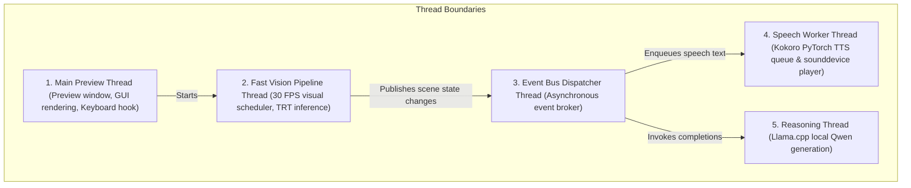
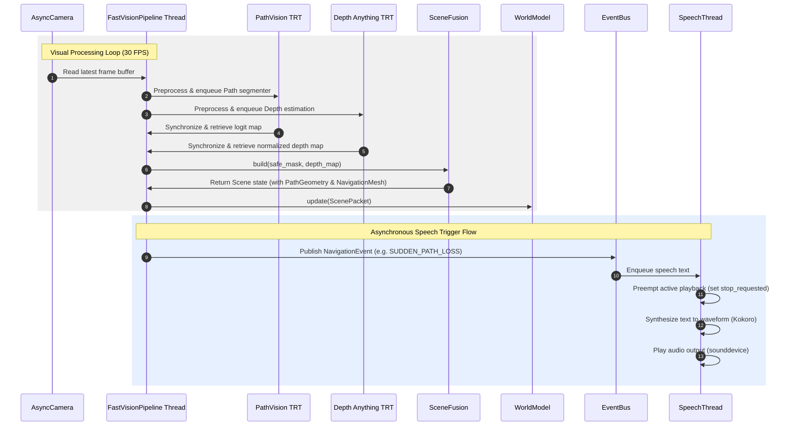
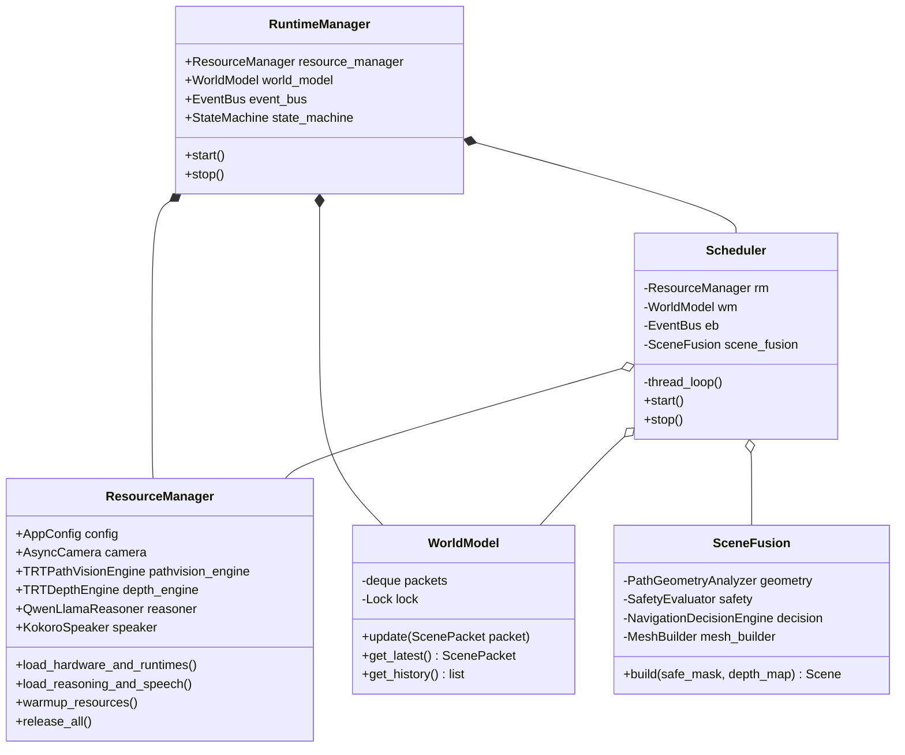
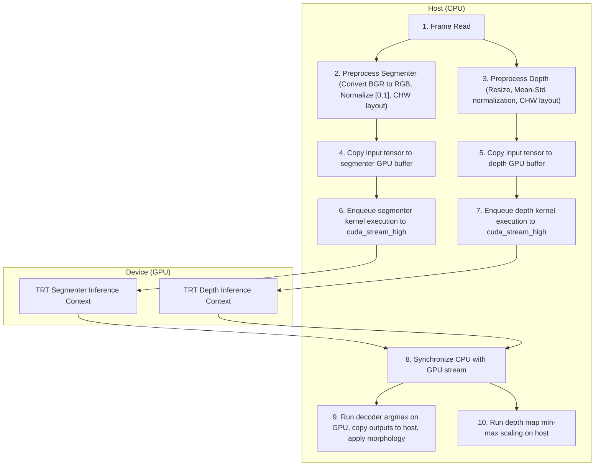

# Software Architecture & Concurrency Model — PathVision Final

This document provides a comprehensive technical overview of the PathVision Final software architecture, data flows, class relationships, and multithreaded concurrency model. It is designed to allow any incoming engineering team to understand the system and begin development immediately.

---

## 1. Concurrency & Threading Model

PathVision Final is built as a real-time, low-latency navigation system designed to run on resource-constrained hardware (laptop CPU + entry-level GPU). To achieve consistent 30 FPS visual processing alongside asynchronous natural language generation and speech synthesis, the system utilizes a **multi-threaded, event-driven decoupled architecture**.

The system divides workload across five distinct execution threads:

### A. Thread Responsibilities & Thread-Safety Policies

1. **Main Preview Thread (GUI & Keys)**:
   - **Responsibility**: Polls keyboard events (using Windows User32 hooks if available, falling back to `cv2.waitKey`), renders visual outputs inside the OpenCV window, and orchestrates startup and shutdown.
   - **Concurrency Rule**: This is the *only* thread permitted to call OpenCV GUI functions (`cv2.imshow`, `cv2.waitKey`, `cv2.destroyAllWindows`). This avoids UI hangs on Windows.

2. **Fast Vision Pipeline Thread (Scheduler)**:
   - **Responsibility**: Operates at a deterministic 30 FPS. Grabs camera frames via `AsyncCamera`, runs PathVision TRT and Depth TRT inference, runs `SceneFusion`, updates the `WorldModel`, and posts events.
   - **Concurrency Rule**: Interacts with the CUDA GPU context via a dedicated high-priority stream (`cuda_stream_high`). Avoids blocking on any disk I/O, speech synthesis, or LLM generation.

3. **Event Bus Dispatcher Thread**:
   - **Responsibility**: Runs a FIFO priority queue listener. When events (e.g. `HAZARD_DETECTED`, `SCAN_REQUEST`) are published, it routes them asynchronously to registered handlers (such as the situation manager, scene memory, or reasoning engine).
   - **Concurrency Rule**: Dispatch logic must complete quickly. Long-running tasks (like GGUF LLM inference) must be offloaded to separate worker threads to avoid stalling event routing.

4. **Speech Worker Thread (Kokoro TTS)**:
   - **Responsibility**: Processes a thread-safe `queue.Queue` of text-to-speech requests. Performs PyTorch-based synthesis on the GPU and plays output through the local audio hardware via `sounddevice`.
   - **Concurrency Rule**: The audio output driver (`sounddevice`) is only accessed from this single thread context to prevent PortAudio access violations on Windows. Preemption is implemented using a thread-safe polling boolean flag (`self._stop_requested`).

5. **Reasoning Thread (Llama.cpp)**:
   - **Responsibility**: Spawns on demand inside `RuntimeManager._safe_generate` when a reasoning generation is triggered. Runs the llama.cpp C++ inference.
   - **Concurrency Rule**: Protected by `self._reasoner_thread_active`. If a previous reasoning thread times out or is still running, new reasoning triggers return fallback text immediately rather than spawning duplicate threads, preventing CPU thread pile-ups.

---

## 2. End-to-End Visual Data Flow

The following sequence diagram illustrates the frame-by-frame data flow, beginning from camera acquisition to final output generation.

---

## 3. High-Level Class Diagrams

The primary interfaces in PathVision Final are organized into three primary layers: **Perception**, **Navigation**, and **Runtime Orchestration**.

---

## 4. GPU Engine Execution Pipeline

To achieve optimal performance on entry-level GPU hardware (such as the NVIDIA RTX 2050 4GB), PathVision Final utilizes a dedicated high-priority CUDA stream to execute model inferences asynchronously, avoiding CPU wait cycles and kernel launching overhead.

---

## 5. Architectural Integrity Rules

To maintain system reliability and prevent concurrency crashes (such as CUDA memory corruption, thread locks, or audio driver failures), all developers must adhere to the following architectural rules:

1. **Do not run PyTorch with default CPU thread configurations**:
   - PyTorch default behaviors will consume all available logical CPU cores during speech synthesis, causing thread starvation on other critical paths. Always set `torch.set_num_threads(2)` on initialization.
2. **Never access PortAudio/sounddevice from multiple threads**:
   - Calling `sounddevice.stop()` or `sounddevice.play()` from the main thread while the speech worker thread is blocked on a playback wait will crash the PortAudio wrapper on Windows. Always communicate preemption via flags.
3. **Keep GGUF model offloaded correctly**:
   - The RTX 2050 only has 4GB VRAM. Never offload llama.cpp GGUF layers to the GPU if the vision engines are running. Keep llama.cpp on the CPU and restrict thread counts.
4. **Acquire locks with timeouts**:
   - Never use blocking `lock.acquire()` without a timeout. Always use `lock.acquire(timeout=2.0)` to ensure that if a thread locks up, the watchdog can identify the failure and restart the pipeline.
