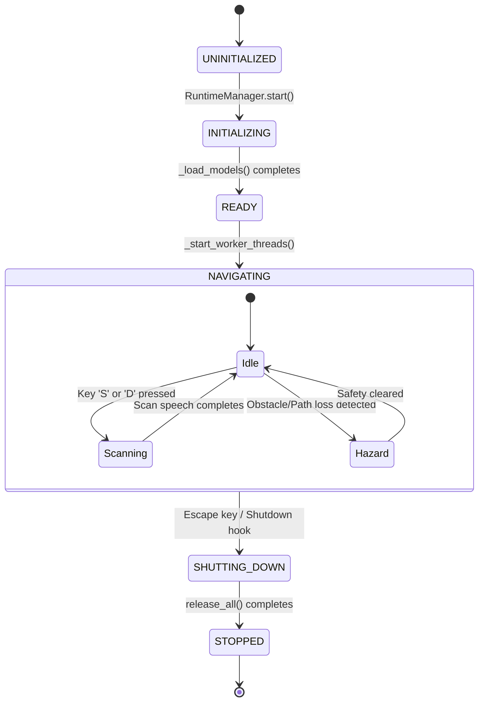
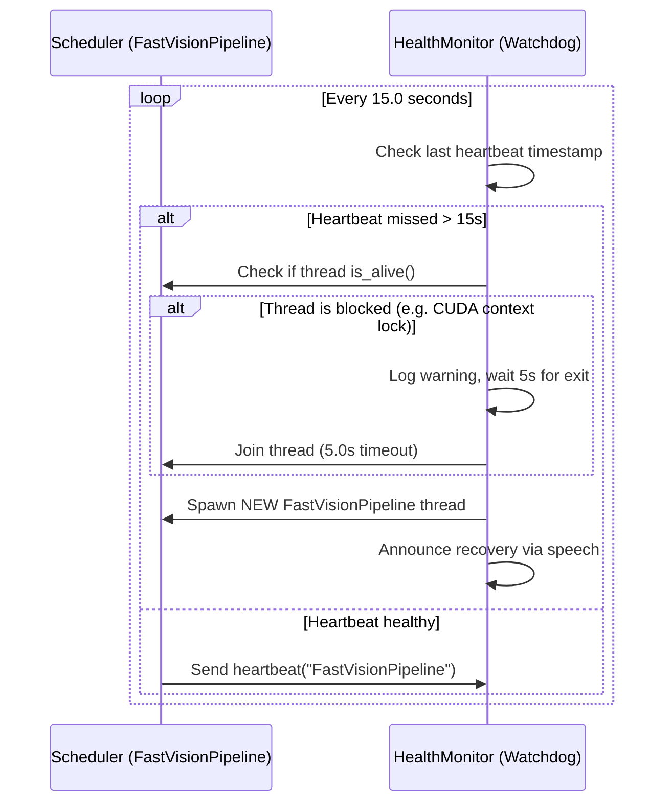

# Runtime Environment & Process Management — PathVision Final

This document explains the runtime lifecycle, state transitions, hardware resource managers, safety watchdogs, and thread-safety synchronization mechanisms that form the backbone of PathVision Final.

---

## 1. Runtime State Machine

PathVision Final governs its operation using a central, deterministic state machine implemented in `RuntimeManager` via the `RuntimeState` enum. This machine ensures orderly resource initialization, warmup, execution, and cleanup.



### State Transitions & Associated Actions

- **UNINITIALIZED**: The state upon object creation. No hardware allocations exist.
- **INITIALIZING**: Allocates the CUDA stream, instantiates camera objects, and deserializes the TensorRT engines.
- **READY**: The models are fully loaded and warmed up. The system speaks `"PathVision system online. Ready to scan."` to verify speech operations.
- **NAVIGATING**: Spawns the `FastVisionPipeline` thread and registers watchdogs. Inside this state, the system continuously transitions between:
  - **Idle**: Routine frame-by-frame navigation.
  - **Scanning**: Actively performing an orientation or description scan (the fast vision thread slows down or pauses, and the Qwen reasoner runs).
  - **Hazard**: Safety state is `danger` or `caution`. Spoken alerts are triggered.
- **SHUTTING_DOWN**: Disables execution flags, joins threads, releases the camera capture context, and frees GPU allocations.
- **STOPPED**: System is safe to exit.

---

## 2. WorldModel Sliding Buffers

The `WorldModel` serves as the centralized repository for all raw, processed, and fused environment states. It maintains thread-safe sliding windows to allow asynchronous reading and writing.

```
       [FastVisionPipeline Thread]
                  |
         (Atomically Writes)
                  v
+-----------------------------------+
|            WorldModel             |
|                                   |
|   +---------------------------+   |
|   |   ScenePacket Queue       |   |
|   |  [P_N, P_N-1, ..., P_0]   |   |  <-- Max capacity: 60 packets (~2 seconds)
|   +---------------------------+   |
|                                   |
+-----------------------------------+
                  |
        (Asynchronously Reads)
                  v
         [QwenReasoner / HUD / Logger]
```

### Implementation Details:
- **Locking Policy**: Reading and writing to the queue are protected by a reentrant lock (`threading.RLock`).
- **Data Contract**: The payload is stored as a `ScenePacket`, which aggregates the BGR frame, depth map, safe path mask, `NavigationMesh` properties, `PathGeometryResult`, and current safety recommendations.
- **Buffer Size**: The buffer is capped at a maximum of 60 packets (representing ~2 seconds of navigation data at 30 FPS). When the limit is reached, old packets are automatically popped to prevent memory expansion.

---

## 3. ResourceManager: Lifecycle, Residency & Warmups

The `ResourceManager` handles memory-critical model residence on the hardware. 

### A. CUDA Streams & Priorities
PathVision Final allocates a high-priority CUDA stream during initialization:
```python
self.cuda_stream_high = torch.cuda.Stream(priority=-1)
```
By passing this stream to the TensorRT engines, the GPU executes inference tasks ahead of low-priority desktop processes, preventing latency spikes.

### B. Warmup Strategy
The first execution of a TensorRT engine on a new GPU context incurs a serialization and memory allocation latency of up to 1.5 seconds. To prevent this latency during active navigation:
- During startup (`warmup_resources()`), the system feeds a tensor of zeros to `pathvision_engine` three times inside the high-priority CUDA stream:
  ```python
  dummy_input = torch.zeros(pathvision_engine.meta.input_shape, dtype=pathvision_engine.meta.input_dtype)
  for _ in range(3):
      pathvision_engine.infer(dummy_input)
  ```
- This forces the GPU driver to allocate intermediate scratch memory and warm up the CUDA kernels before the user begins walking.

---

## 4. Scheduler & HealthMonitor Watchdog

The `Scheduler` runs the continuous 30 FPS visual loop. Because it is critical to user safety, it is guarded by a watchdog system.



### Collision Guard:
If the watchdog restarts the pipeline, there is a risk of a **CUDA Collision**. If the old scheduler thread is still blocked on a slow GPU operation (e.g., waiting for CUDA stream synchronization), spawning a new thread that immediately invokes TensorRT will cause two threads to access the same `nvinfer1::IExecutionContext` context, causing memory corruption and a segfault.

To prevent this:
1. The watchdog checks `scheduler._thread.is_alive()`.
2. If alive, the watchdog waits up to 5.0 seconds for the old thread to join and release the context.
3. If it still fails to join, the watchdog logs a critical error and avoids starting a new thread, preventing a segfault and ensuring graceful degradation rather than a process crash.

---

## 5. Single-Threaded Audio Preemption

The speech system in `speech/kokoro.py` implements a single-threaded execution design to prevent PortAudio access violations on Windows:

```
[EventBus / Main Thread]               [Speech Worker Thread]
           |                                     |
    (Preemption Event)                           |
           |                                     |
    Sets stop_requested = True                   |
           |                                     |
           |                      (Checks flag inside 50ms loop)
           |                                     |
           v                                     v
         [NOP]                            stop_requested? -> True
                                                 |
                                         Stops sounddevice
                                                 |
                                         Clears audio buffer
```

### Why this is necessary:
PortAudio’s Windows MME wrapper is not thread-safe. If the main thread calls `sounddevice.stop()` while the speech thread is blocked inside `sounddevice.wait()`, PortAudio will crash. 

### Polling Implementation:
```python
duration = len(audio) / self._sample_rate
t_start = time.perf_counter()
while time.perf_counter() - t_start < duration:
    if not self._running or self._stop_requested:
        if self._sounddevice is not None:
            self._sounddevice.stop()
        break
    time.sleep(0.05) # 50ms polling resolution
```
This design ensures that the hardware audio interface is only controlled by the background speech worker thread, securing 100% audio stability.
