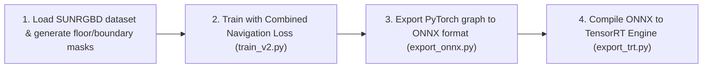

# Walkability Model Training & Compiler Pipeline — PathVision Final

This document explains the offline training pipeline, transfer learning, mathematical loss formulations, and compilation process for the PathVision safe-path segmentation model.

---

## 1. Transfer Learning Dataset: SUNRGBD

PathVision Final is trained by performing transfer learning from general indoor scene segmentation to physical walkability segmentation.

### A. Floor Segmentation Label Mapping
We use the **SUNRGBD** dataset, which contains 10,335 indoor scene images with dense 3D and 2D semantic labels. In SUNRGBD's label layout, we map categories to our three navigation target classes:
- **Walkable Floor Class**: Floor labels (MATLAB index `11`) and floor mats (MATLAB index `143`).
- **Obstacle Class**: All other structural, furniture, and object labels (e.g. wall, table, chair, box).
- **Boundary Class**: Generated by computing the outline contour edges of the walkable floor masks.

---

## 2. Mathematical Loss Formulations

To ensure that the model generates sharp navigation boundaries and avoids false safety predictions, we train using a **Combined Navigation Loss** function:

$$\mathcal{L}_{\text{total}} = w_{1} \mathcal{L}_{\text{Lovasz}} + w_{2} \mathcal{L}_{\text{Focal}} + w_{3} \mathcal{L}_{\text{Dice}}$$

Where the weights are configured as:
- $w_{1} = 1.0$ (Lovasz-Softmax Loss)
- $w_{2} = 1.0$ (Focal Loss)
- $w_{3} = 0.5$ (Dice Loss)

### A. Lovasz-Softmax Loss
Lovasz-Softmax directly optimizes the Jaccard index (Intersection over Union, IoU), which is the standard evaluation metric for semantic segmentation. For class $c$, the loss is computed using the Lovasz extension of submodular functions over sorting errors:

$$\mathcal{L}_{\text{Lovasz}}(c) = \sum_{i=1}^{P} e_i \cdot g_i$$

Where $e_i$ is the sorted prediction error and $g_i$ is the gradient of the Lovasz extension:

$$g_i = J(I_i) - J(I_{i-1})$$

This loss directly penalizes boundary misalignments, which is critical for identifying precise path borders.

### B. Focal Loss
Focal Loss addresses class imbalance (where background pixels outnumber walkable path pixels) by dynamically down-weighting the loss assigned to easy-to-classify pixels, focusing training on hard boundary features:

$$\mathcal{L}_{\text{Focal}} = -\alpha (1 - p_t)^{\gamma} \log(p_t)$$

Where:
- $p_t$ is the model's estimated probability for the ground truth class.
- $\alpha = 1.0$ is the class balance coefficient.
- $\gamma = 2.0$ is the focusing parameter.

### C. Dice Loss
Dice Loss measures global overlap between the prediction mask and ground truth mask, preventing regional prediction dropouts:

$$\mathcal{L}_{\text{Dice}} = 1 - \frac{2 \sum_{i} p_i g_i + \epsilon}{\sum_{i} p_i + \sum_{i} g_i + \epsilon}$$

Where $p_i$ is the predicted probability, $g_i$ is the ground truth binary value, and $\epsilon = 10^{-5}$ is a smoothing coefficient to prevent division by zero.

---

## 3. Training & Compilation Pipeline

The model training and deployment process follows a 4-step pipeline:



### Step 1: Model Training
Run training using the transfer learning script:
```powershell
python research/train_v2.py --dataset_dir D:\Datasets\SUNRGBD --epochs 50 --batch_size 16
```
This freezes the encoder layers for the first 10 epochs, uses AdamW with learning rate $3 \times 10^{-4}$, and saves the best model checkpoint to `models/best_pathvision.pth`.

### Step 2: Export to ONNX
Export the PyTorch model checkpoint to a standard ONNX graph format:
```powershell
python research/export_onnx.py --checkpoint models/best_pathvision.pth --output models/pathvision.onnx
```
This exports the model with a fixed batch size of 1 and static input dimensions `(1, 3, 240, 320)`.

### Step 3: Compile to TensorRT
Compile the ONNX graph into a high-performance TensorRT engine file:
```powershell
python research/export_trt.py --onnx models/pathvision.onnx --output engines/pathvision.engine --fp16
```
The compilation script uses TensorRT’s builder optimizer, runs layer profiling, merges conv-batchnorm layers, and configures the engine to run in FP16 precision.
